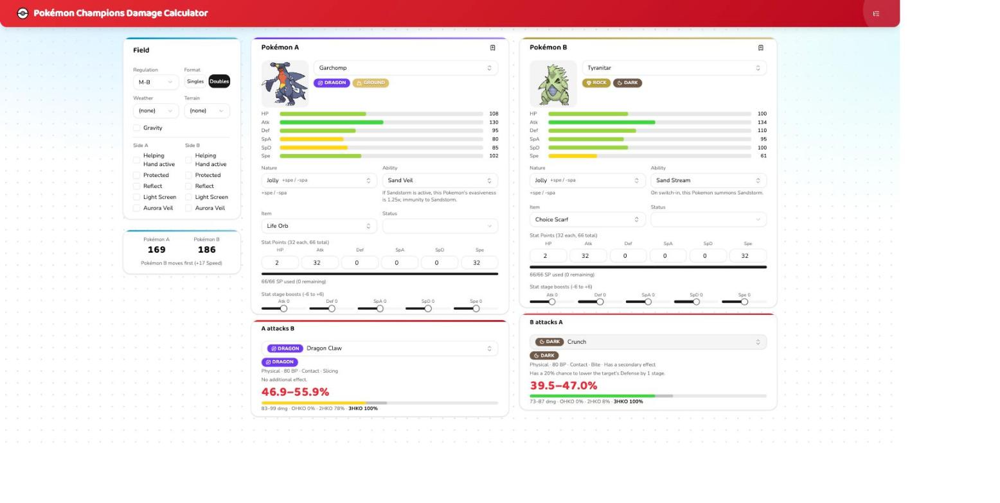
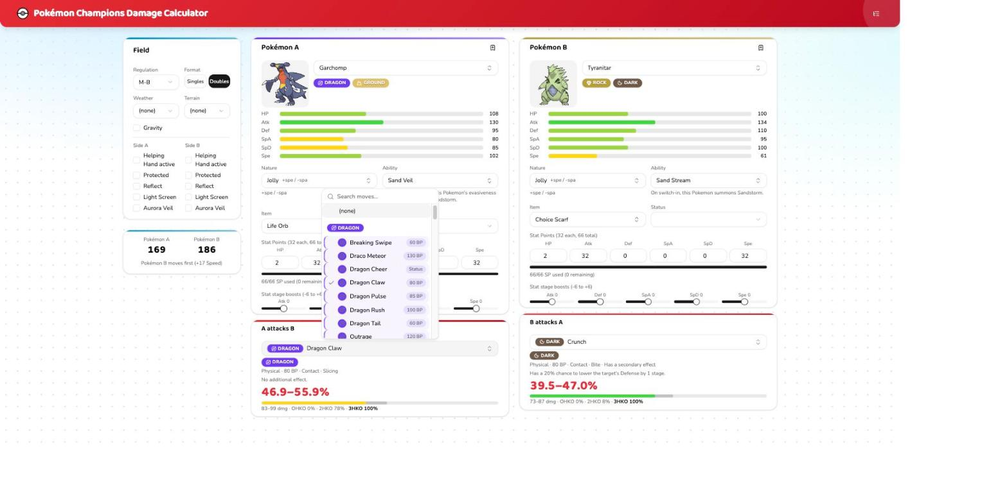

# Pokémon Champions Damage Calculator

A damage calculator for [Pokémon Champions](https://champions.pokemon.com/en-us/), built the way [Pokémon Showdown's damage calc](https://github.com/smogon/damage-calc) works for the mainline games: pick two builds, pick a move, get the real roll range, KO chances, and speed order — using Champions' own rules (Regulation M-A/M-B item legality, the current move/ability/item dex, and the ladder-suggested sets).



## What it does

- **Damage & KO chances** — full 16-roll damage range and hit-by-hit KO probability for any attacker/defender/move combination, including multi-hit moves, drain, recoil, and secondary effects.
- **Speed comparison** — who moves first, accounting for stat stages, items, abilities, weather, and paralysis, shown independently of move selection.
- **Field state** — Singles/Doubles, weather, terrain, gravity, Protect/Helping Hand, and per-side screens (Reflect/Light Screen/Aurora Veil).
- **Full build editor** — species, nature, ability (filtered to what that species can actually have), item (filtered by regulation legality, with Mega Stones locked to their species), status, EV/IV-equivalent stat points, and stat stage boosts.
- **Type-aware move picker** — moves grouped by type, with the attacker's own STAB type(s) sorted first, real color-coded type badges and icons throughout.
- **Saved teams** — save/load/delete builds into named teams, stored locally.



## How it's built

```
poke_calc/          Python damage engine + FastAPI backend
├── engine/           the actual damage math (unchanged since it was
│                     validated to 0 mismatches across 6500+ differential
│                     tests against @smogon/calc — see NOTICE)
├── data/             baked Champions dex data (species/moves/items/...)
└── api/              thin FastAPI layer exposing the engine over HTTP

web/                 React + TypeScript + Tailwind + shadcn/ui frontend
```

The frontend is a thin, typed client over the Python engine — nothing about damage calculation lives in TypeScript. FastAPI's OpenAPI schema is used to generate the frontend's types directly, so the two sides can't silently drift apart.

## Running it locally

```bash
# backend (from poke_calc/poke_calc/)
source .venv/bin/activate
uvicorn poke_calc.api.main:app --reload --port 8000

# frontend (from web/)
npm install
npm run dev
```

Then open **http://localhost:5173**. See [DEVELOPMENT.md](DEVELOPMENT.md) for the full command reference (tests, production build, regenerating dex data, etc.).

## Attribution

This project vendors and adapts third-party work — the damage formula itself and the Champions dex data. Full attribution and licenses are in [NOTICE](NOTICE).
